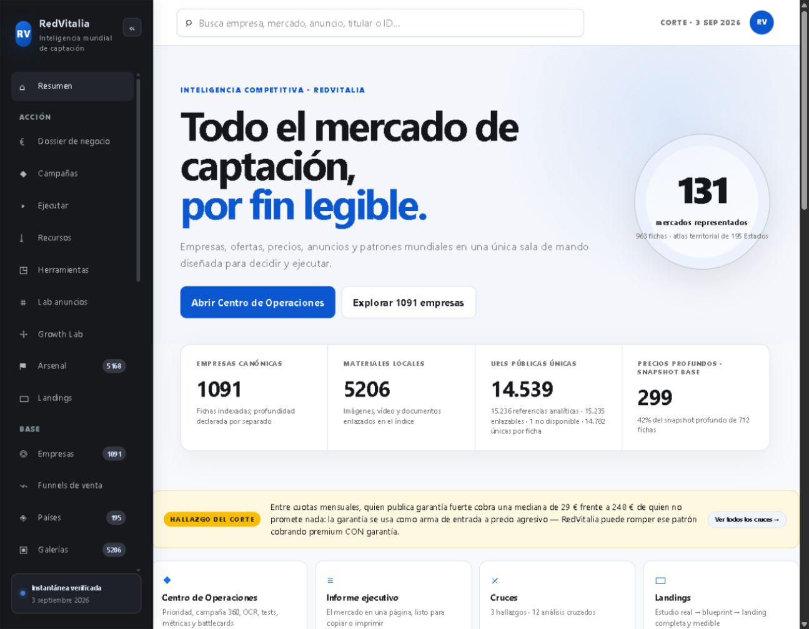
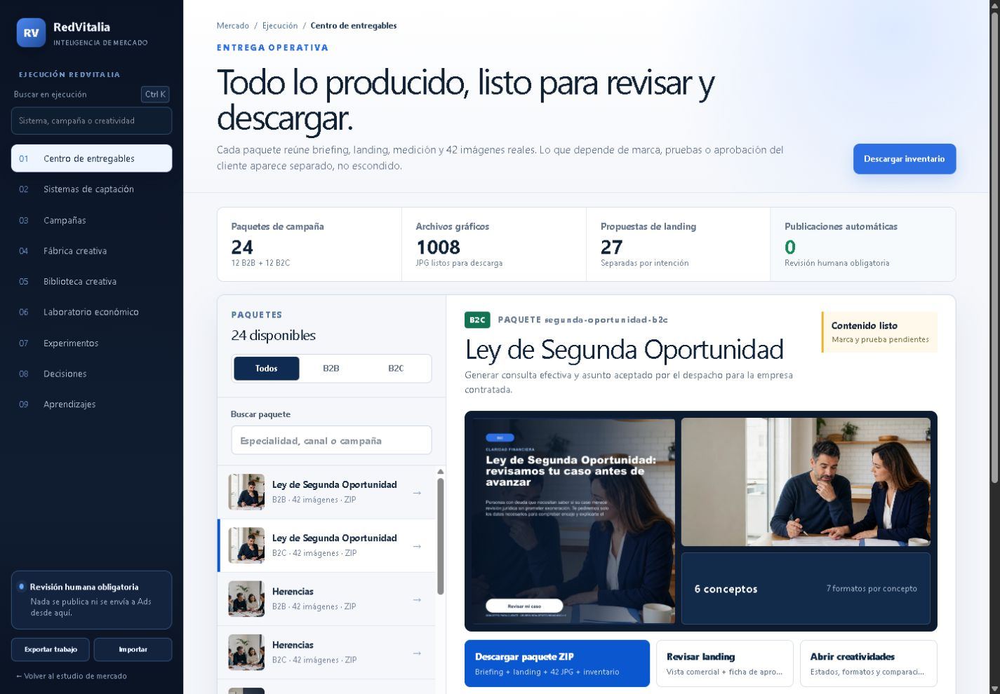
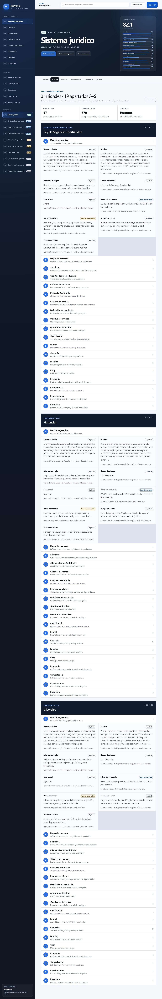
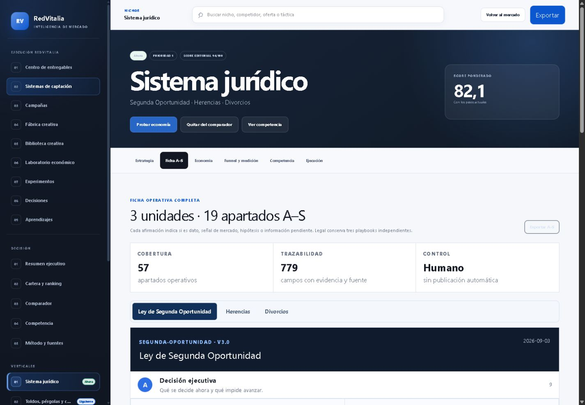
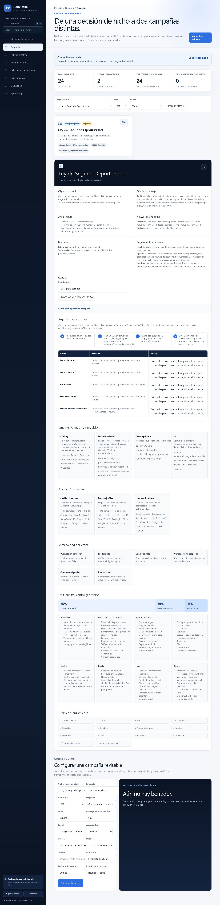
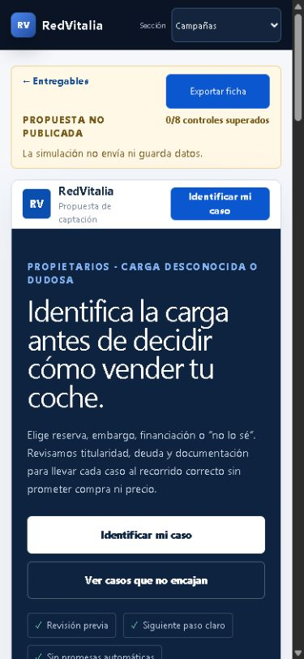
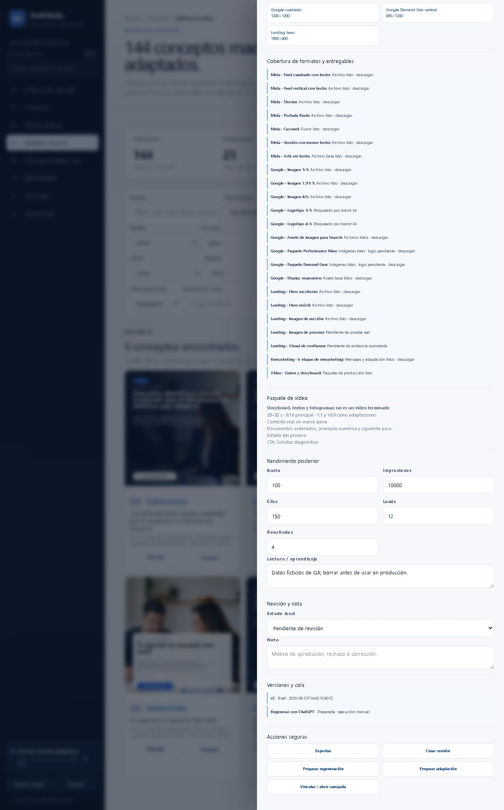
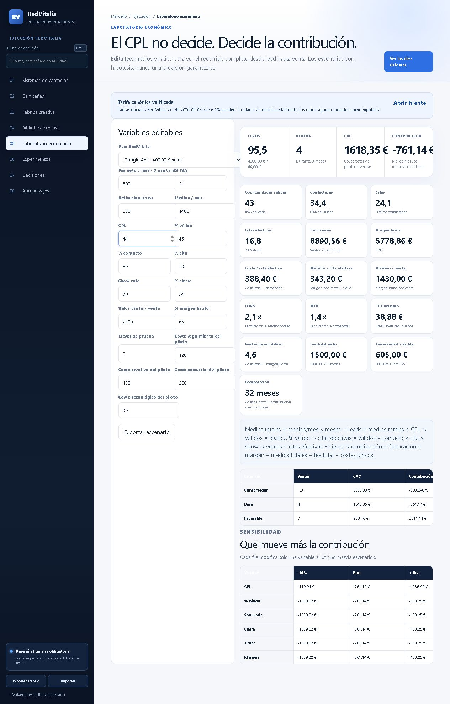
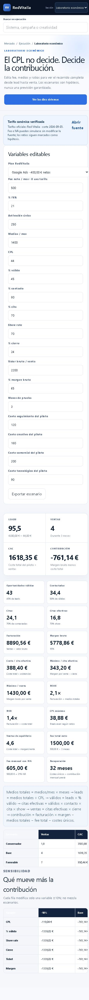
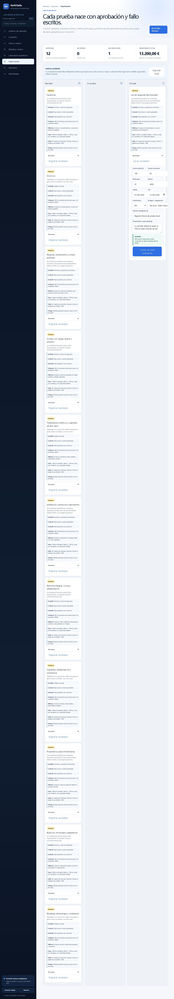

# Informe ejecutivo · Sistema operativo RedVitalia

> Archivo histórico de la revisión realizada en esta fecha. Para el estado vigente, los entregables actuales y las 40 rutas añadidas después, consulta `docs/redvitalia/README.md` y la aplicación.

**Fecha de corte:** 3 de septiembre de 2026

**Producción auditada:** https://redvitalia.srv1480016.hstgr.cloud/

**Repositorio:** `isra477200/rep2`

**Base de producción:** `redvitalia-radar-deploy` · `e71cb5e`

**Rama de revisión:** `codex/ampliacion-redvitalia-20260903`

**Commit base de esta ampliación:** `9125604bf8772fb2b490aa51f6e6d22957e8f1de`

**Commit final de mejora visual y entregables:** `72e4b2f`

**Pull request:** https://github.com/isra477200/rep2/pull/7

**Producción:** no desplegada ni modificada.

## Decisión ejecutiva

La ampliación deja de ser una colección de pantallas y se convierte en un sistema operativo de captación revisable. Está preparada para revisión funcional, comercial y legal; no está autorizada para publicar campañas ni captar datos reales.

El sistema contiene diez verticales, doce unidades de captación, veinticuatro campañas B2B/B2C, doce fichas operativas A–S, veintisiete landings propuestas, una biblioteca de 144 conceptos y una capa de economía, experimentos, decisiones y aprendizaje. Todos los estados y cálculos distinguen dato, señal de mercado, hipótesis y pendiente.

La siguiente decisión correcta no es “desplegar todo”, sino completar la puerta del primer piloto de Ley de Segunda Oportunidad: cliente, territorio, capacidad, marca, legal, CRM, tracking, economía real, prueba autorizada y aprobación humana.

## Qué se conservó

- Mercado, empresas, países, funnels, galerías, comparador y expedientes existentes.
- Dossier, Growth Lab, laboratorio de anuncios y editor de landings.
- Corpus competitivo y fuentes originales.
- Arquitectura y rutas existentes; no se añadieron iframes.
- Rama y despliegue de producción intactos.

## Resultado construido

### 1. Centro de entregables y paquetes reales

La revisión visual final añade una superficie de entrega que abre directamente sobre el trabajo producido. Ya no es necesario navegar por paneles técnicos para localizar los archivos:

- 24 paquetes ZIP independientes, uno por campaña B2B/B2C.
- 42 JPG dentro de cada paquete: seis conceptos por siete formatos.
- Briefing completo, landing, estado e inventario CSV dentro de cada ZIP.
- Inventario maestro JSON/CSV con hash SHA-256 por paquete.
- Índice HTML autónomo y mapa visual de los 24 paquetes.
- 100,5 MB de archivos comprimidos comprobados.

La aplicación incorpora `/entregables` como primera ruta operativa. Cada selección muestra las piezas reales, el contenido incluido, la landing relacionada y los bloqueos que todavía dependen del cliente.

### 2. Navegación y continuidad operativa

Se mantienen las ocho rutas anteriores y se añade una novena ruta nativa: `/entregables`, `/sistemas`, `/campanas`, `/creativos`, `/biblioteca-creativa`, `/laboratorio`, `/experimentos`, `/decisiones` y `/aprendizajes`.

La capa incorpora búsqueda global con acceso por teclado, navegación móvil, migas de pan, filtros persistentes, vistas guardadas e importación/exportación versionada. El archivo importado queda limitado a 2 MB, 200 bloques y 200 KB por bloque; solo admite claves de la capa RedVitalia.

### 3. Doce fichas operativas A–S

Cada unidad de captación dispone de una ficha completa con los diecinueve apartados pedidos, desde decisión ejecutiva hasta ejecución. El sistema jurídico conserva tres playbooks independientes para Segunda Oportunidad, Herencias y Divorcios.

- 12 playbooks.
- 228 secciones A–S.
- 3.106 campos operativos con estado de evidencia y fuente.
- Riesgos, datos pendientes, cualificación, funnel, CRM, campañas, landing, copy, economía, experimentos y puertas de lanzamiento separados por unidad.
- Exportación JSON individual y control humano visible.

La revisión de legibilidad cambia la presentación de Legal: las tres unidades se eligen con pestañas y solo se muestra una ficha cada vez. Los diecinueve apartados siguen completos, pero únicamente el primero queda desplegado al entrar.

### 4. Ranking de cartera con catorce dimensiones

El ranking ya no reduce la decisión a cinco variables. Puntúa demanda, valor, margen, cualificación, demostrabilidad, competencia, defendibilidad, experiencia, velocidad de aprendizaje, riesgo legal controlable, estandarización, escalabilidad, coste mental y volumen.

Los pesos son editables y la cartera muestra el movimiento respecto al orden editorial. Los pesos antiguos o corruptos se normalizan antes de calcular: durante la QA visual se detectó y corrigió un `NaN` provocado por preferencias guardadas con el esquema anterior.

### 5. Veinticuatro paquetes de campaña completos

Cada unidad tiene una campaña B2B y otra B2C. Cada paquete conserva:

- resumen estratégico y arquitectura;
- grupos, intención, audiencias, ubicaciones, negativas, horarios y dispositivos;
- oferta, landing, formulario por capas y conversiones;
- puja inicial, evolución por señal de valor e importación offline;
- tres rutas creativas;
- remarketing en seis etapas;
- email, WhatsApp, llamada, no-show y reactivación;
- presupuesto por canal;
- KPI, controles, riesgos, criterios de escala y parada;
- puerta de lanzamiento de catorce comprobaciones.

Nada se conecta ni se envía a Google Ads o Meta Ads desde la aplicación.

### 6. Veintisiete landings revisables

- 24 propuestas B2B/B2C, una por unidad y modalidad.
- 3 recorridos adicionales para coches: reserva de dominio, embargo/precinto y financiación pendiente.
- La entrada general de coches hace triaje y conserva “no lo sé”.
- Hero, encaje, descarte, formulario, proceso, FAQ, atribución, evento, evidencia pendiente y puerta de publicación.
- Simulador de formulario con validación real de campos, teléfono y consentimiento usando datos temporales; nunca envía ni guarda la prueba.

La QA detectó y retiró un campo de consentimiento duplicado. La revisión final separa visualmente la experiencia comercial y la ficha interna: la primera pantalla ya contiene mensaje, fotografía, confianza, CTA y formulario realista; el control técnico queda después. La página mantiene un único consentimiento explícito y no activa el evento hasta una validación simulada correcta.

### 7. Fábrica y biblioteca creativa

- 12 imágenes base creadas con ChatGPT, sin texto integrado.
- 3 rutas × 2 conceptos × B2B/B2C por unidad.
- 72 conceptos B2B + 72 B2C = 144 conceptos maestros.
- 7 adaptaciones físicas por concepto = 1.008 JPG descargables.
- 144 miniaturas WebP y 12 bases WebP públicas; los 12 PNG originales quedan fuera del paquete público.
- Matriz de 23 entregables por concepto = 3.312 registros de cobertura.

La matriz distingue archivos listos, guiones, recursos bloqueados por brand kit, prueba real pendiente, evidencia autorizada pendiente y vídeo no producido. Un storyboard no se etiqueta como vídeo terminado.

La biblioteca filtra por especialidad, modalidad, ruta, estado, formato, cliente, campaña, canal, ángulo, fecha y rendimiento. Admite vistas guardadas, notas, métricas posteriores, comparación, versiones y una cola local de regeneración/adaptación. “Preparar” una regeneración no finge una API externa: registra el trabajo para ejecución manual.

### 7. Economía y sensibilidad

El laboratorio calcula el piloto completo desde medios hasta contribución. Separa fee neto, IVA, activación, duración, seguimiento, creatividad, comercial y tecnología. Muestra leads, válidos, contacto, citas, asistencia, ventas, facturación, margen, CAC, costes máximos, break-even, CPL máximo, ROAS, MER y recuperación.

Además de los escenarios conservador, base y favorable, incluye sensibilidad ±10 % para CPL, validez, show rate, cierre, ticket y margen. El fee se puede simular sin alterar la tarifa canónica. La tabla se hizo desplazable y se corrigió un desbordamiento móvil de 261 px encontrado en la QA.

### 8. Experimentos, decisiones y aprendizaje

Los experimentos registran control, variante, volumen, gasto, fechas, fuente, rango, confianza y aprendizaje. El cierre se bloquea si falta fuente, periodo, valores comparables o muestra mínima. La lectura automática supone una métrica de coste: aprueba con al menos 15 % de mejora, falla con al menos 15 % de deterioro y marca el resto como inconcluso. Nunca escala presupuesto automáticamente.

La QA descubrió que algunos navegadores no propagaban el cambio de los campos de fecha al estado de la aplicación. Se añadió compatibilidad por entrada y cambio y se verificó un cierre completo con muestra ficticia.

Las decisiones exigen fuente, fecha y razonamiento antes de entrar en estados de comprobación o aprobación. Un estado antiguo guardado no puede mantener una decisión “aprobada” si falta esa evidencia. Los aprendizajes exigen título, detalle, fuente y fecha y pueden enlazar experimento, decisión, rango, confianza y riesgo.

## Evidencia y fuentes

### Dato canónico

- Tarifas RedVitalia verificadas: Google Ads 400 €, Meta Ads 450 €, Google + Meta 750 €, Google + Meta + SEO básico 1.000 €, setter/activación 250 €, más 21 % de IVA.
- Fuente declarada en la aplicación: https://app.notion.com/p/360f1447360c80ec93cae6183e599a37
- Corte del módulo canónico: 3 de septiembre de 2026.

### Especificaciones publicitarias oficiales

- Google Responsive Display: 1,91:1, 1:1 y logotipos 1:1/4:1: https://support.google.com/google-ads/answer/17090561
- Google Demand Gen: 1:1 de 1.200×1.200, 1,91:1 de 1.200×628 y 4:5 de 960×1.200: https://support.google.com/google-ads/answer/17091672
- Assets de imagen para Google Search: imagen cuadrada obligatoria y horizontal recomendada: https://support.google.com/google-ads/answer/9566341
- Meta Reels: creatividad vertical 9:16 y elementos importantes dentro de zona segura: https://www.facebook.com/business/ads/facebook-instagram-reels-ads

### Hipótesis y pendientes

- Medios, CPL, ratios, ticket, margen, capacidad y recuperación siguen siendo hipótesis editables hasta recibir datos del cliente.
- Los 55 competidores y 68 cruces de nicho proceden del corpus de mercado ya existente; no equivalen a rendimiento propio.
- No hay resultados reales de campañas en esta entrega.

## Verificación técnica final

- TypeScript: correcto.
- Lint completo: correcto, sin errores ni avisos.
- Build de producción local: correcto.
- Pruebas específicas de ejecución y entrega: 13/13.
- Growth, inteligencia, landings y patrones publicitarios: 60/60.
- Integridad del portal y medios: 9/9.
- Rutas y descargas críticas comprobadas por HTTP: centro de entregables, landing de coches, sistemas, campañas, ZIP de campaña e inventario maestro, todas con estado 200.
- Inventario verificado: 1.008 JPG, 144 miniaturas WebP, 12 bases WebP y 12 PNG fuente.
- Paquetes verificados: 24/24 ZIP, 42 imágenes por paquete, 24 hashes SHA-256 distintos y 100,5 MB totales.
- QA visual de nueve rutas clave en escritorio y móvil: un `h1`, controles etiquetados, botones nombrados, imágenes con `alt` y sin desbordamiento material.
- Búsqueda global: atajo Ctrl/Cmd+K y resultados contextuales verificados.
- Consola del navegador: 0 errores y 0 avisos al terminar la prueba.
- Dependencias de producción: 0 vulnerabilidades según `npm audit --omit=dev`.
- Diferencias Git: sin errores de espacios ni marcadores accidentales.

## Rendimiento y riesgo técnico

- JS/CSS cliente: 2.222.939 bytes sin comprimir. Son 122.447 bytes más que la segunda pasada, aproximadamente +5,8 %, a cambio de fichas A–S, campañas profundas, filtros, sensibilidad y trazabilidad adicional.
- El chunk `ExecutionWorkspace` queda en 63.530 bytes y `NichosDashboard` en 132.278 bytes, ambos sin comprimir.
- Las tablas económicas mantienen su ancho interno y desplazan solo dentro del componente en móvil; ya no ensanchan la página.
- Vinext emite una advertencia informativa porque aún no clasifica estática o dinámicamente algunas rutas mediante análisis estático. No impide el build ni la respuesta del servidor.
- El servidor de desarrollo mostró avisos de renderizadores concurrentes únicamente durante recargas en caliente mientras se editaba. La compilación y el servidor de producción local finalizaron correctamente.

## Bloqueos reales antes de producción

1. Identidad del cliente piloto, razón social, contacto, territorio y horarios.
2. Brand kit, logotipos y derechos de imagen.
3. Revisión legal de claims, privacidad, consentimiento y tratamiento de datos sensibles.
4. Endpoint real del formulario, CRM, estados, responsables, SLA y motivos de pérdida.
5. CMP, GTM, eventos, deduplicación e importación de conversiones offline.
6. Datos económicos reales: ticket, margen, capacidad, valor y periodo de maduración.
7. Credenciales y aprobación humana de Google Ads/Meta Ads.
8. Casos, testimonios, reseñas o pruebas autorizadas.
9. Producción de vídeo real; hoy existen guion, storyboard y fotogramas de referencia.
10. Sincronización en vivo con Notion o paneles privados; esta entrega usa el corte documentado y no dispone de credenciales de escritura.

## Rollback

No hay cambios en producción. Para retirar esta ampliación de la rama de revisión se debe crear un commit de reversión sobre `9125604`; no usar un reset destructivo. Si la PR llegara a fusionarse, repetir build, lint, TypeScript y pruebas después de la reversión y antes de cualquier despliegue.

El procedimiento detallado está en `PLAN-ROLLBACK.md`.

## Próxima acción recomendada

1. Abrir `entregables-redvitalia/INDEX.html` y revisar visualmente los 24 paquetes.
2. Revisar la PR #7 sin fusión ni despliegue automáticos.
3. Completar la puerta mínima del piloto de Segunda Oportunidad.
4. Sustituir hipótesis económicas por datos firmados por el cliente.
5. Validar legal, marca, privacidad, tracking y CRM.
6. Aprobar manualmente una campaña B2B, una B2C y un lote creativo reducido.
7. Publicar solo el piloto aprobado y devolver resultados offline.
8. Abrir Herencias y Divorcios únicamente cuando exista volumen y aprendizaje documentados.
